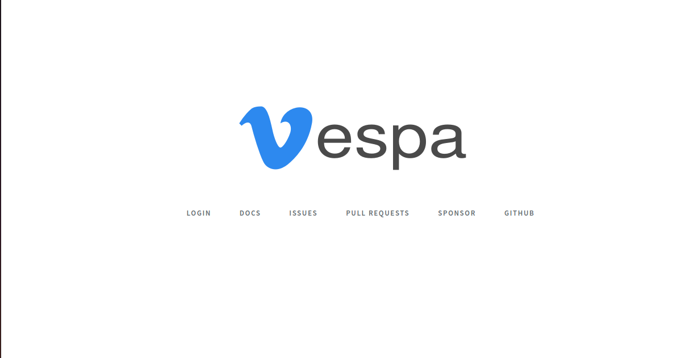
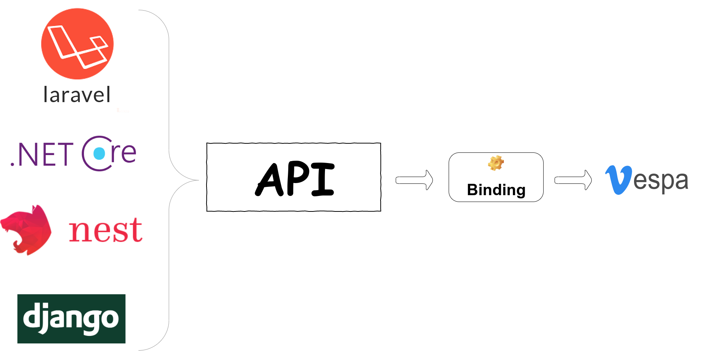

## 🔥 Beautifully designed administration panel for (Nodejs, Laravel, Java Spring, Ruby On Rails , Django , Asp.net Core ...) 🛵🛵🛵

Vespa is simply an admin for your app. Whatever you want your app to do on the back-end is completely up to you.
🚦Vespa is not a CMS or a blogging platform but it can be used to create a CMS or a blogging platform, but out of the box it is neither of those. With Vespa you can create any kind of application your heart desires.

    
     
    
	
    
    

  Created by and maintained with ❤️ by  <a href="https://github.com/getspooky">getspooky</a>.

## Features

Here are some of the awesome Vespa features you'll enjoy ✌💪

- Scalable and Maintainable architecture
- Back-end agnostic (Connect to any server side including 
([Asp.net core](https://docs.microsoft.com/en-us/aspnet/?view=aspnetcore-3.1),[Laravel](https://laravel.com/)/[symphony](https://symfony.com/),[Nestjs](https://nestjs.com/)...)
- (Redux, Swagger, Docker) integration
- CRUD Builder
- JWT authentication
- Command-line interface

## Installation Steps

### 1. Require the Package
This is a Node.js module available through the npm registry.
Installation is done using the [npm install command](https://docs.npmjs.com/downloading-and-installing-packages-locally):
<pre>
 npm install -g getvespa
</pre>

### 2. Add the DB Credentials & APP_URL & Swagger host/port
Next make sure to create a new database and add your database credentials to your .env file:

<pre>
APP_NAME=
APP_KEY=
APP_ENV=env
APP_HOST=
APP_PORT=
APP_DEBUG=
SWAGGER_PORT=
SWAGGER_HOST=
</pre>

### 3. Run The Installer
Lastly, we can install voyager.
<pre>
 npm run vespa:install
</pre>

And we're all good to go! 
Start up a local development server with `npm run start` 

To see your application in action, open a browser window and navigate to http://localhost:8080. You should see the Vespa default information page:

## Requirements
Vespa has a few requirements you should be aware of before installing:

- Node.js >= 8.0.0
- npm >= 6.10.3

## Browser Support

Vespa supports reasonably recent versions of the following browsers:

- Google Chrome
- Apple Safari
- Microsoft Edge
- Mozilla Firefox

## Schema explanation

## Security Vulnerabilities

If you discover a security vulnerability within Vespa, please send an e-mail to `Yasser Ameur El Idrissi` via getspookydev@gmail.com . All security vulnerabilities will be promptly addressed.

## Changelog

Please see [CHANGELOG](CHANGELOG.md) for more information what has changed recently.

## Contributing
Please see [CONTRIBUTING](CONTRIBUTING.md) for details.

## How Can I Help?

- Contribute to the core repository.
- Ask your employer to use Vespa in projects.
- Make a tutorial that you explain Vespa.
- Follow our Vespa repository.

## License
The MIT License (MIT). Please see [License File](LICENSE.md) for more information.
